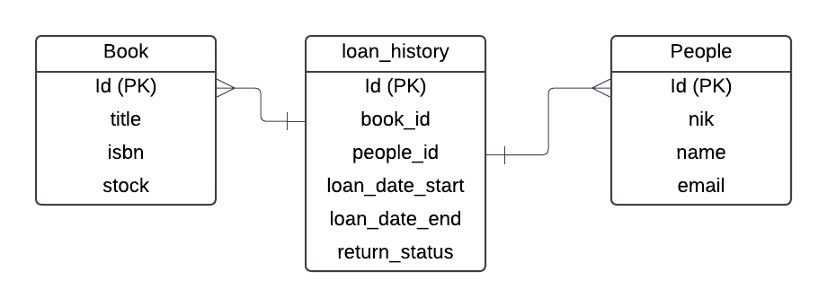

# README

### Design of Relational Database
Before develop REST API for the assessment, I designed relational database like the attached design below.

### List of REST API

* REST API for Book Management: 

  * Create new book: POST /api/back-office/book/create 
  * Get list of book: GET /api/back-office/book?keyword={keyword}
  * Get detail of book: GET /api/back-office/book/{id}

* REST API for People Management: 

  * Create new people: POST /api/back-office/people/create 
  * Get list of people: GET /api/back-office/people?keyword={keyword}
  * Get detail of people:  GET /api/back-office/book/{id}

* REST API for Loan Book Processing: 

  * Loan a book: POST /api/back-office/loan
  * Return a book: PUT /api/back-office/return/{loanId}
  * Get List of Loan book:  POST /api/back-office/loan/list

### Additional Assumptions

* There's possible that have duplicated title book and name of people
* Payload attribute to describe people and books using id from each entity, assuming when selecting books and people data using the dropdown feature on client-side which returns list of people and book object 
* Process returning book is assumed by just clicking some button on client-side for return the book, no more update the other data
* Assumed if people or books already deleted can't recreated